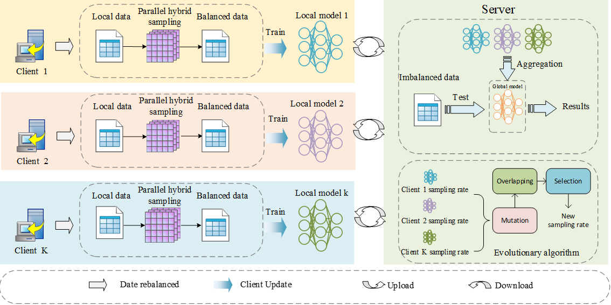

# Fed-AHS: An Adaptive Hybrid Sampling Federated Learning Framework

## Introduction



Federated Learning (FL) enables multiple clients to collaboratively train a global model without sharing raw data, thereby preserving data privacy. However, class imbalance and data heterogeneity across clients significantly degrade the performance of FL systems, especially for real-world tabular and structured datasets.

To address these challenges, this project proposes **Fed-AHS (Federated Adaptive Hybrid Sampling)**, an adaptive sampling federated learning framework that integrates parallel hybrid sampling with evolutionary optimization. Each client locally rebalances its data before training, while the server adaptively optimizes client-specific sampling rates to improve global model robustness and fairness.


## Environment and Dataset

### Datasets
- All datasets are obtained from open-source repositories.
- Data must be standardized before training.
- Stratified 10-fold cross-validation is used for evaluation.
- Class labels:
  - `0`: majority class
  - `1`: minority class

### Environment Configuration
The experimental environment is defined in:

```bash
environment.yaml
```

This file contains all required dependencies to ensure reproducibility.

---


## How to Use

### 1. Environment Setup

```bash
conda env create -f environment.yaml
conda activate fedahs
```

### 2. Run the Federated Server

Fed-AHS follows a server–client architecture. To start the framework, run:

```bash
python server.py
```

The server coordinates client selection, model aggregation, and adaptive sampling rate optimization.


## Notes

This framework is intended for research and experimental purposes and can be easily extended to other imbalance-aware federated learning scenarios.
